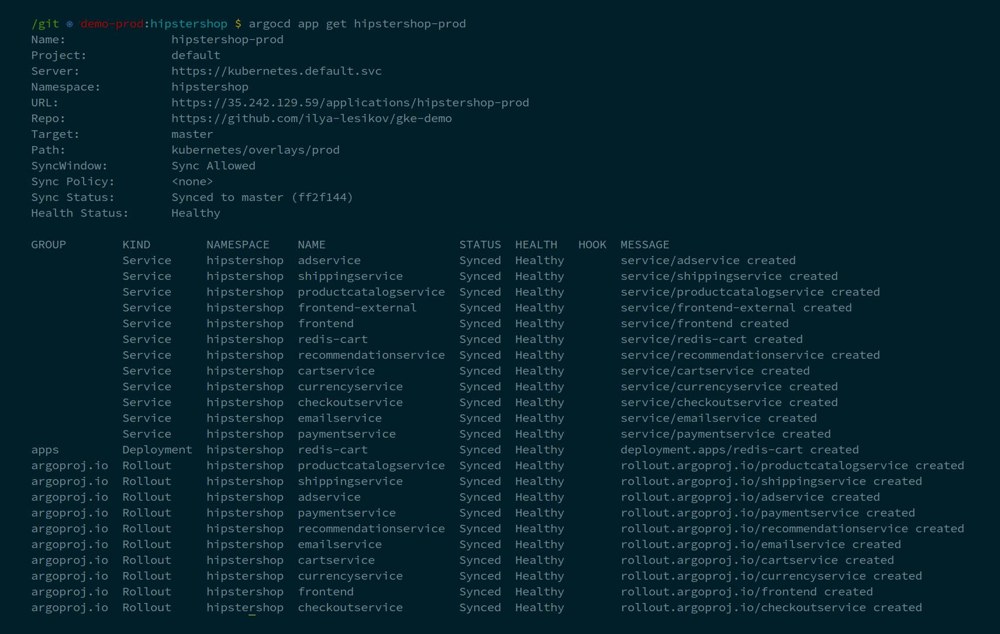
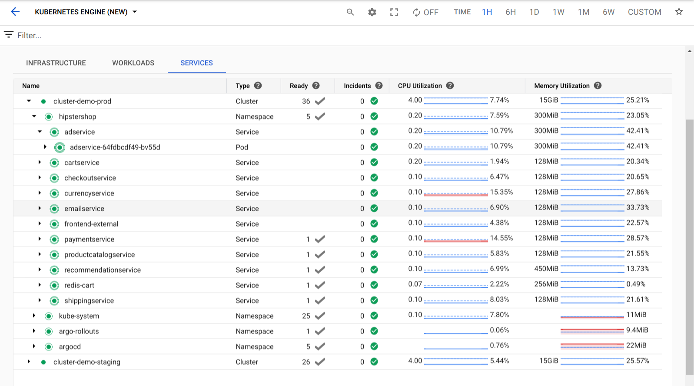
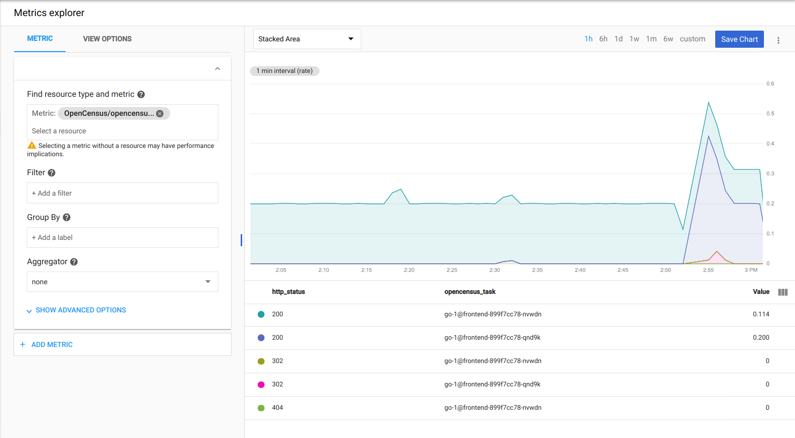
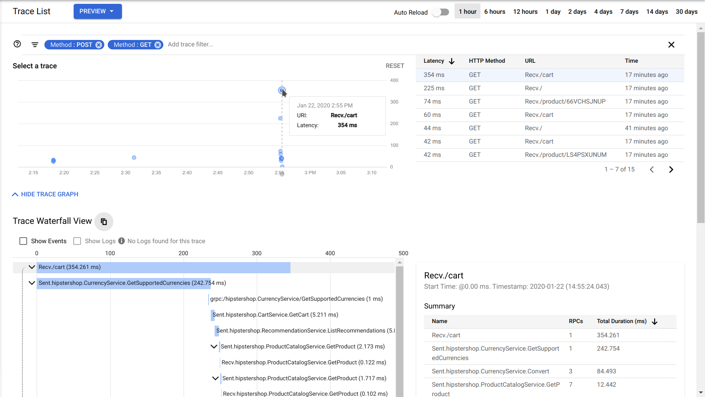
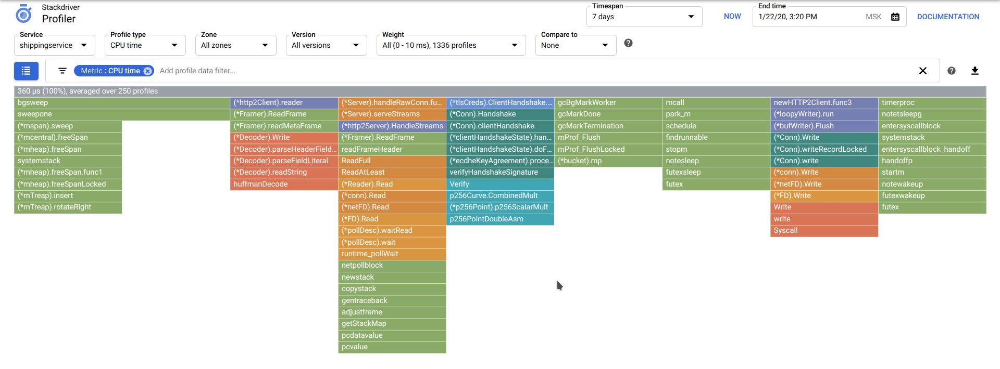
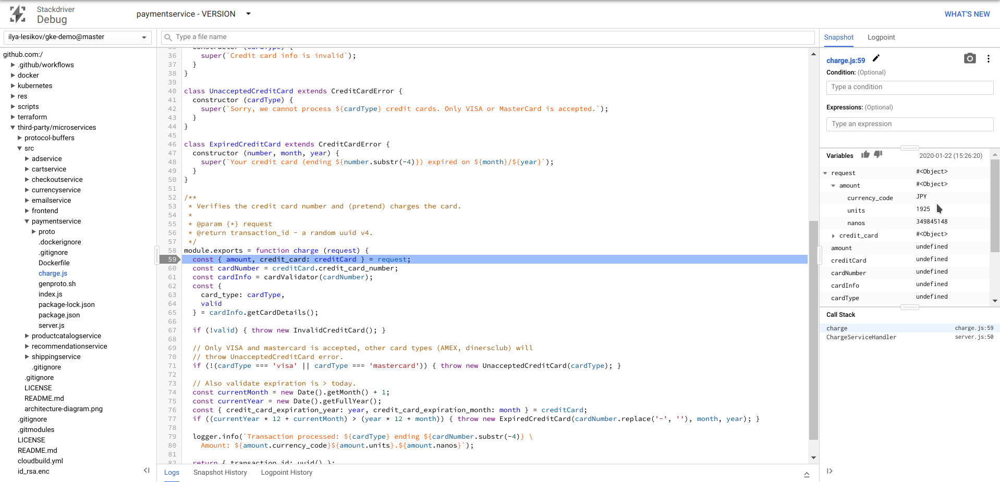

> Demonstration of complete, fully-featured CI/CD and cloud automation for microservices, done with GCP/GKE

## Features <a name="features"/>

* Multistage deployments (staging, prod)
* Canary deployments
* Horizontal pod/instance autoscaling
* Rollbacks, self-healing
* Distributed tracing, monitoring, logging, profiling, debugging

Setup/deployment is heavily automated so it will be easy for you to deploy it by yourself using [GCP account with Free Trial](https://cloud.google.com/free)

## Contents
1. [Features](#features)
1. [Software](#software)
1. [How it works](#how)
1. [Quick start](#quick-start)
1. [Looking around](#looking-around)
1. [Cleanup](#cleanup)
1. [Implementing this in the real-world](#real-world)
1. [Known issues](#known-issues)
1. [Halp?](#halp)
1. [Hire me](#hire-me)

## Software <a name="software"/>

| What                                                            | For                                                   |
|-----------------------------------------------------------------|-------------------------------------------------------|
| Terraform, Terragrunt                                           | Cloud automation                                      |
| Kubernetes (GKE), Kustomize                                     | Container orchestration                               |
| Google Cloud Build                                              | CI                                                    |
| ArgoCD, Argo Rollouts                                           | CD                                                    |
| Google Stackdriver                                              | Monitoring, logging, tracing,<br>profiling, debugging |
| Cloud KMS, Container Registry,<br>Storage and other GCP goodies |                                                       |

Also we are using [10 microservices from Google](./third-party/microservices) with built-in instrumentation for Stackdriver

## How it works (simplified) <a name="how"/>


## Quick start <a name="quick-start"/>

1. You need [GCP account with Free Trial](https://cloud.google.com/free) activated
1. You need [GitHub account](https://github.com/join)
1. Fork this repo (we can't setup GCB triggers for repositories you don't own)
1. You need Docker installed (any OS)

1. Run and attach to the docker container:
   ```bash
   # Change this to the owner of the forked "gke-demo" repo, don't leave it like this
   GITHUB_USERNAME=ilya-lesikov

   # Run container with all the tooling we need:
   # NOTE: you can change "TF_VAR_project_id" in this command to point to the existing GCP project
   docker run -d --name gke-demo \
     -e TF_VAR_project_id=gke-demo-$GITHUB_USERNAME \
     -e TF_VAR_github_demo_owner=$GITHUB_USERNAME \
     ilyalesikov/gke-demo

   # Attach to the container
   docker exec -it gke-demo bash
   ```

1. Prepare for cloud provisioning (this is run from the inside of the container):
   ```bash
   # Clone the repo you forked
   git clone https://github.com/${TF_VAR_github_demo_owner}/gke-demo

   # Run this and follow the instructions on your screen.
   # This will authorize us to access your GCP account and the "gke-demo" repo you forked.
   ./gke-demo/scripts/prepare.sh && source /root/.bashrc
   ```

1. Provision our cloud infrastructure with Terraform/Terragrunt:
   > On any transient errors (e.g. SSL/TLS errors or `remote server closed connection`) just rerun the `terragrunt` command. Terragrunt handles _most_ of these automatically, but Terraform sucks so much it'll need 10 wrappers to be truly reliable
   ```bash
   cd gke-demo/terraform/environments
   terragrunt apply-all --terragrunt-non-interactive
   ```

1. Build and deploy **all** of our applications:
   ```bash
   git tag -d release_all
   git push --delete origin release_all
   git tag release_all
   git push origin release_all   # This will trigger our CI/CD
   ```

1. Opening this page should start creation of Monitoring workspace and will activate Stackdriver: https://console.cloud.google.com/monitoring/dashboards

1. Now just wait for the build to complete: https://console.cloud.google.com/cloud-build/builds

   

1. Works now!

## Looking around <a name="looking-around"/>

First, switch to our production cluster:
```bash
kubectl config use-context "gke_${TF_VAR_project_id}_europe-west2-a_cluster-demo-prod"
```

Check if our app is synced and healthy:

```bash
argocd app get hipstershop-prod
```



---

List our canary rollouts:

```bash
kubectl argo rollouts list rollouts
```


---

Check out details for some particular rollout/microservice:

```bash
kubectl argo rollouts get rollout adservice
```


---

We even have a neat web-interface to manage our applications lifecycle, do rollbacks, etc:

```bash
IP="$(argocd context | awk 'NR==2 {print $3}')"
PASS="$(kubectl get pods -n argocd -l app.kubernetes.io/name=argocd-server -o name | cut -d'/' -f2)"
printf '\nThe web-interface is here: https://%s, username is "admin", password is "%s"\n\n' "$IP" "$PASS"
```


---

Now buy something in our "Hipstershop" application to produce some data for Stackdriver:

```bash
IP="$(kubectl get service frontend-external | awk 'NR==2 {print $4}')"
printf '\nApplication is here: http://%s\n\n' "$IP"
```


### Stackdriver

#### Monitoring

Simple k8s monitoring dashboard:

https://console.cloud.google.com/monitoring/dashboards/resourceList/kubernetes



There are lots of metrics out of the box, thanks to GCP, GKE, Kubernetes, Istio and instrumentation on applications side:

https://console.cloud.google.com/monitoring/metrics-explorer



#### Distributed tracing

https://console.cloud.google.com/traces/list



#### Profiling

https://console.cloud.google.com/profiler



#### Debugging

https://console.cloud.google.com/debug



## Cleanup <a name="cleanup"/>

This should destroy everything, except Terraform remote state bucket and enabled services/APIs:
```bash
cd /git/gke-demo/terraform/environments
terragrunt destroy-all --terragrunt-non-interactive
```

As an alternative, this will completely delete the project, cleaning up everything we've created:
```bash
gcloud projects delete $TF_VAR_project_id
```

Stop and remove the container with the tooling from your system (run this outside the container):
```bash
docker rm -f gke-demo
```

You might want to remove GCB application from your GitHub account too.

## Implementing this in the real world <a name="real-world"/>

This project has some nice (and useful in production systems) things implemented, but this is nevertheless a demonstration. What I would do differently if this would be making me $$$:

1. Dump Google Cloud ~~Abomination~~Build. The worst thing in this demo I worked with so far. In the end it feels more like a one big ugly shell script split into chunks, each of them executed in a separate container. When it works, it works, but... it doesn't even have dependencies between the builds and no sane way to handle concurrency. Almost no builders, existing ones are as sophisticated as `RUN apt install terraform, ENTRYPOINT terraform`.

   Check out Concourse, Drone CI, Spinnaker, or if you are going 100% Kubernetes try something like Argo stack, it was a breeze to work with ArgoCD/Rollouts.

1. The repo should be split at least in two — one for the shared infrastructure automation code (e.g. Terraform), the other one for microservices. I would say that you better split your microservices in different repos too, this will allow for cleaner CI, though I heard about people using monorepos. There is still some glue needed to avoid versioning mess and race conditions in your CI/CD when you have multiple microservices developed, tested and deployed simultaneously.

1. You'll need to streamline developers workflow on their local machines with something like Minikube and Skaffold. Developer should be able to deploy microservices and accompanying software (DBs) that is needed to properly develop/test his own microservice on his local machine, to minimize testing in staging environment (it's much slower and more expensive). It will be a sort of a replacement for `docker-compose.yml` files in the root of application repo that helps you deploy DBs and stuff and maybe even microservices you are heavily depend on.

1. Versions are pinned as precisely as they could in all the places, this is just to keep this demo working without much maintenance. Updating these pinned versions programmatically is always a big PITA, but this is a right way and you need to figure it out. As a simplified workflow you can pin to the minor (not patch) version, so that patch updates applied automatically. This way you'll need to go through your code and repin minor versions manually from time to time. And of course uncontrolled patch updates can break things sometimes, but that will happen rarely, so it's a kind of a trade-off between reliable and simple.

1. For all of this to actually be reliable and resilient you need comprehensive testing on many levels, including E2E and load testing.

1. You might not want to instantly and without any confirmation deploy to production every thing that passed staging environment.

1. Industry-standard Prometheus might be a better choice than proprietary Stackdriver.

1. I didn't use more traditional CMS like Ansible, since all my needs were covered by Terraform and Kubernetes. It still might be useful when working with VMs, but with hosted K8S I didn't really need that.

1. There might be something else ~~that I didn't know~~ ~~that I forgot~~ that I didn't know.

1. `$ grep -RE 'TODO|FIXME'`

## Known issues <a name="known-issues"/>

1. `Missing required GCS remote state configuration project` \
   Reason: sometimes Terragrunt can't parse few keys (e.g. `project`) in `remote_state.config`. \
   Workaround: `/git/gke-demo/scripts/terragrunt-cleanup.sh`

2. Terragrunt/Terraform fails during init phase \
   Workaround: `/git/gke-demo/scripts/terragrunt-reinit.sh` \
   If didn't help: `/git/gke-demo/scripts/terragrunt-cleanup.sh`

3. `connection reset by peer`, `connection closed`, SSL/TLS errors \
   Reason: Terraform sucks \
   Workaround: rerun failed command

## Halp? <a name="halp"/>

I tested it many times, but I could have missed something. \
If you experience any problems, let me know and leave an issue, thanks.

## Hire me <a name="hire-me"/>

 Website: [ilya-lesikov.com](https://ilya-lesikov.com) \
 Email: [hire@lesikov.com](mailto:hire@lesikov.com) \
 LinkedIn: [ilya-lesikov](www.linkedin.com/in/ilya-lesikov)
